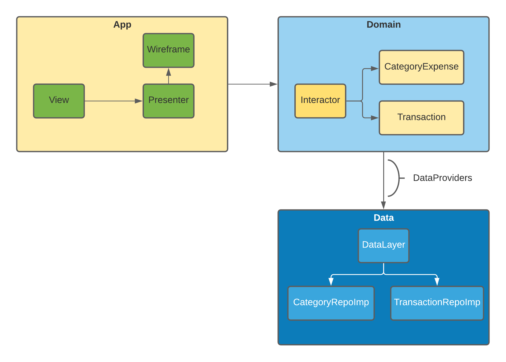

# Project Architecture Design

## Introduction

This architecture is based on the Clean Architecture by Uncle Bob. The main focus of the architecture is separation of concerns and scalability. It consists of three main modules: Domain, App and Data.

## The Dependency Rule

**Source code dependencies only point inwards.** This means inward modules are neither aware of nor dependent on outer modules. However, outer modules are both aware of and dependent on inner modules. Outer modules represent the mechanisms by which the business rules and policies (inner modules) operate. The more you move inward, the more abstraction is present. The outer you move the more concrete implementations are present. Inner modules are not aware of any classes, functions, names, libraries, etc.. present in the outer modules. They simply represent rules and are completely independent from the implementations.

## Domain

The Domain module defines the business logic of the application. It is a module that is independent from the development platform i.e. it is written purely in the swift, also allows for easy migration between platforms, such as MacOS or iPadOS.

### Contents of Domain

Domain is made up of several things:

- Entity
    - Enterprise-wide business rules
    - Business objects of the application
    - Used application-wide
    - Least likely to change when something in the application changes
- Interactors (Usecases)
    - Application-specific business rules
    - Orchestrate the flow of data throughout the app
    - Should not be affected by any UI changes whatsoever
    - Might change if the functionality and flow of application change
- Repositories
    - Protocols that define the expected functionality of outer layers
    - Passed to interactor from outer layers

Domain represents the inner-most layer. Therefore, it the most abstract layer in the architecture.

## App

App is the layer outside Domain. App crosses the boundaries of the layers to communicate with Domain. However, the Dependency Rule is never violated. Using polymorphism, App communicates with Domain using protocol defined inside Domain and implemented in Data layer. The implementation is hidden behind the polymorphism.

### Contents of App

Since App is the presentation layer of the application, it is the most framework-dependent layer, as it contains the UI and the event handlers of the UI. For each module, App defines Presenter, view and wireframe.

- View
    - Represents only the UI of the page. And depends on the presenter to handle events.
- Presenter
    - Communicate with interactor, handle successful response, completion or erroring.
    - Provide data to view, and handle view events, deal with value binding. Also does some   
      extra filtering.      
- Wireframe
    - Responsible for initialising next view with necessary paramters like presenter,
      interactor or viewmodel.
- Extra 
    - Utility: define some helper functions
    - Config: define constant     
  
## Data

Represents the data-layer of the application. The Data module, which is a part of the outermost layer, is responsible for data retrieval. This can be in the form of API calls to a server, a local database, or even both.

### Contents of Data

- Repositories
    - Every Repository should implement Repository Protocol from the Domain layer.
    - Retrieve data from databases or other methods.
    - Responsible for any API calls and high-level data manipulation such as
       - Handling local storage
       - Calling an API

- Extra
    - Utility
    - Helper: PersistenceController
    - Database: Core Data