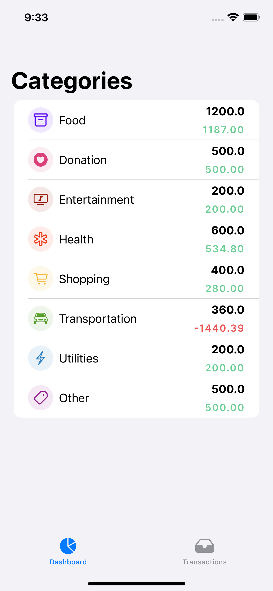
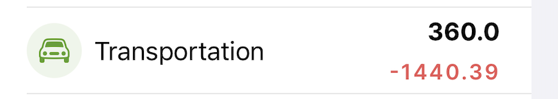
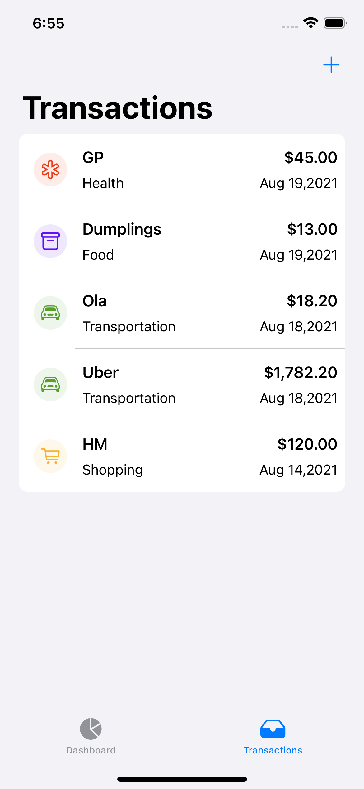
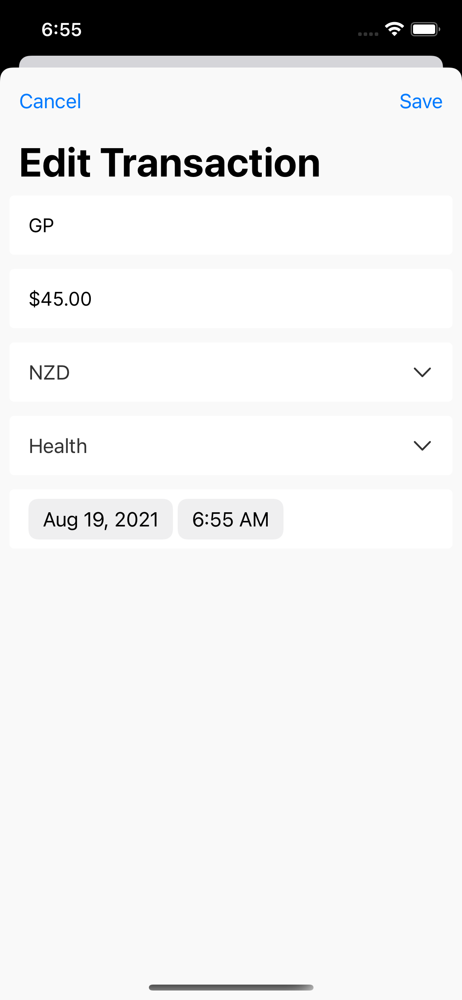
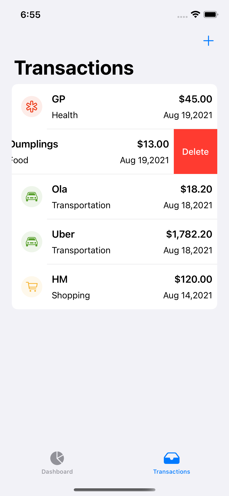

# SmartTracker

#### ⚠️ To run this project, please use lastest Xcode 13 Beta 5 (Beta 4 is also OK) ⚠️

## Contents

- [Requirements](#requirements)
- [Features](#features)
- 
## Requirements

- iOS 15.0
- Xcode 13 Beta 5
- Swfit 5.5
- Mac OS (Monterey) - Optional

## Features

- Display pre-defined categories with **budget** and current **total expense** in current month
- Highlight category if total expense of it exceed its budget
- Display transaction list with local currency(NZD)
- Support Add / Edit Transaction on title, amount, currency, category, date and time.
- Support deleting one transaction
- Fetch latest *USDNZD* rate from [Currency Layer]( https://currencylayer.com)
- Support ** Datalayer** to save app data to the local database (CoreData)

### Display Categories

### Highlight category when expense over budget

Each category has monthly budget, if the current expense of it exceeds this value, the total expense text will be highlighted in red, like below screenshot:

### Display Transactions

Transaction list shows all transactions with title, category, amount in NZD and occurOn date. All transaction records with USD currency will be converted to NZD automatically on this page.

### Add / Edit Transaction

User can click "+" button(top right) to add a new transaction or tap on existing transaction to edit it.

### Delete Transaction

User can delete one transaction by swipe item to left.

### Fetch latest currency rate

*Datalayer* is responsible for fetching lastest USD to NZD currency rate and save it in @AppStorage.

### DataLayer

This is for keeping user's transaction records into local database by using CoreData with *Repository Pattern*